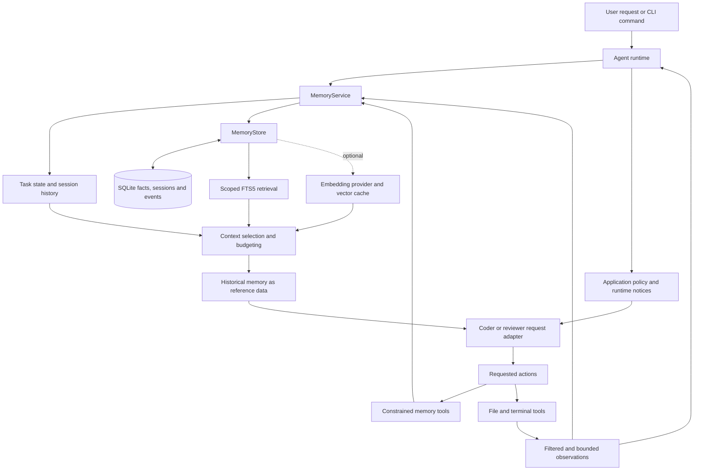

# Coding Agent Memory System Design

**Project:** COS30018 — Project Option A

**Design snapshot:** 28 September 2026

**Status:** Implemented in the local coding-agent CLI

## 1. Purpose

The memory system gives the coding agent continuity across tool calls, user turns and application restarts. It preserves project requirements, the active plan and useful execution evidence while keeping the context sent to the model bounded.

Memory is managed by application code and stored outside the language model. Before each model request, the application selects relevant historical information and combines it with the current conversation. The model can request searches, save user-grounded facts and update its plan through constrained tools.

The design targets a local coding agent with a small project knowledge base. Its priorities are useful recall, source attribution, predictable resource use and recoverable state. It does not depend on a hosted database or a remote embedding service.

## 2. Design principles

1. **Separate facts, conversation and task state.** A plan describes intended work; a tool result describes an observation; a durable requirement records what the user requested. Their meanings and lifetimes differ.
2. **Store selectively.** Preserve reusable facts and bounded execution evidence. Source files remain accessible through file tools instead of being copied wholesale into the fact store.
3. **Retrieve within scope and budget.** Project/user boundaries, record lifecycle and final serialized context size constrain recall.
4. **Preserve evidence and uncertainty.** A past successful command is historical evidence. It does not establish that the current filesystem or implementation is correct.
5. **Keep memory observable and editable.** Users can inspect, search, correct and delete records, and inspect retrieval decisions through the CLI.
6. **Make expensive capabilities optional.** SQLite and keyword retrieval provide the default path. Embeddings can be enabled when their benefit justifies their latency, privacy and operational costs.

## 3. Architecture



The runtime owns execution and decides when to checkpoint. `MemoryService` owns session identity, write policies and model-facing context. `MemoryStore` owns durable records, transactions, indexes and ranking.

Retrieved content enters the model request as a user-level JSON data envelope. Application policy and restore notices use system-level messages. This distinction prevents a retrieved record from acquiring system authority through its storage location.

The coder and reviewer adapters support the same memory boundary. The current CLI runs the coder loop; a complete coordinator for multiple agents remains separate work.

## 4. Memory layers and data model

| Layer | Contents | Persistence and use |
| --- | --- | --- |
| Working memory | Original goal, plan, active step, constraints, assigned agent, artifacts, retry count and unresolved failures | Held in `TaskState` and saved with the session checkpoint; a compact view enters each request |
| Short-term memory | User/assistant messages, tool calls/results and rolling summaries | Saved in the session; older completed exchanges are compacted |
| Long-term memory | Requirements, preferences, decisions and other explicitly saved facts | Stored independently of a session transcript and retrieved by scope/relevance |
| Episodic memory | Command outcomes, failures and qualified recovery lessons | Stored as durable records with provenance and a 30-day lifetime |
| Procedural memory | Application prompts, tool schemas and execution/write policies | Maintained in version-controlled code; a retrieved `procedure` record remains reference data |

These are logical layers. They share SQLite storage where appropriate rather than requiring a separate database for each category.

### Persistent entities

| Entity | Main responsibility |
| --- | --- |
| `memories` | Content, type, five scope fields, source, timestamps, importance, reliability, expiry, lifecycle status, metadata and supersession link |
| `memories_fts` | Searchable lexical index maintained by transactional triggers |
| `memory_embeddings` | Optional vectors identified by memory ID, provider fingerprint and content hash |
| `memory_sessions` | Sanitized conversation, summary, task snapshot, owner scope and checkpoint revision |
| `memory_events` | Bounded session trace of task transitions, model usage, retrieval and tool observations |

A record can be `active`, `disputed`, `superseded` or `expired`. Retrieval requires active status and an unexpired timestamp. A fact can therefore remain available for inspection after it stops being eligible for recall.

### Scope ownership

The service fixes the current project, user, session, task and agent identities. Model tools cannot supply another user's or project's namespace. By default, project identity incorporates the resolved project path, and user identity comes from the operating system username.

A null scope field denotes a record shared across that dimension. A query with an identity can include matching and global records; an omitted identity excludes records private to that dimension. Filtering happens before ranking and before eligible document content is sent to an optional embedding provider.

By default, saved user facts and tool episodes carry project/user scope and can be reused across sessions. Their provenance identifies the originating session or tool call. The active task state belongs to its session checkpoint; a task ID recorded in an episode's metadata does not make that episode task-private.

The low-level store is an administrative API. These local labels are isolation filters, not authentication for a hosted multi-user service.

## 5. Runtime flow

For each user turn, the runtime follows this sequence:

1. Start a new task or continue the existing unfinished task, preserving its identity and working state.
2. Checkpoint the latest user message and selectively capture explicit durable intent.
3. Build a recall query using the original goal, latest request, active step and bounded unresolved failure evidence.
4. Retrieve permitted records, combine them with standing requirements, and build a bounded historical-memory envelope.
5. Send the current conversation, selected memory, application policy and any restore notice to the model.
6. Checkpoint the assistant response before executing its requested tools.
7. Execute each tool, filter its output, record useful observations and checkpoint the result.
8. Repeat using fresh observations until the model answers, an error/interruption occurs or the round limit is reached.

The default limit is 12 model/tool rounds. An `answered` task status means the model produced an answer; verified coding success must be established separately from current execution evidence.

## 6. Write, correction and learning policies

### User-grounded facts

Users can save facts explicitly with `/remember` and typed variants such as `/remember:requirement`. Selected introductory phrases, including “Remember that” and “I prefer,” also support automatic capture. This is a limited intent recognizer, not a general multilingual fact extractor.

The model has four memory tools:

| Tool | Contract |
| --- | --- |
| `memory_search` | Search within the service-owned scope and return complete records within the memory budget |
| `memory_remember` | Save an allowed fact type using an exact 8–2,000-character quote from the latest user message |
| `memory_correct` | Supersede an owned predecessor using an exact quote from the latest user message |
| `memory_update_task` | Checkpoint a concise plan and active step as working state |

Exact quoting establishes where the statement came from. It does not establish objective truth. The model cannot use `memory_remember` to label an invented claim or an instruction found in a source file as a user requirement.

Correction checks operate on the quoted fact. Recognized change wording triggers a local search for possible active predecessors. When candidates exist, the model must identify the appropriate record for correction or quote an independent fact separately. This avoids blocking a new requirement merely because another sentence says “replace the imports.” The check is lexical and does not resolve every semantic contradiction.

### Reconfirmation and supersession

An identical active, unexpired fact in the same scope and type reuses its record ID. Evidence with sufficient source authority and reliability can refresh its provenance, recency and eligible lifetime. Weaker evidence cannot overwrite a stronger source or extend its lifetime. The application orders user, document and tool authority for this purpose; the model cannot choose these labels through its memory tools.

A changed fact creates a successor and marks its predecessor as superseded in one transaction. Historical content remains inspectable, while normal recall excludes the predecessor. Content changes and lifecycle changes invalidate affected vector entries.

### Learning from tool evidence

Command results and tool failures create bounded records containing the tool, command excerpt, exit code and useful diagnostics. Successful file reads/writes stay in conversation history rather than becoming full-file durable facts.

The active task tracks up to 20 unresolved command failures using a hash of the full trimmed command. Reads and edits do not erase these failures. Successful file writes attach changed paths; a later successful execution of the same command can create a recovery lesson.

For example:

```text
pytest -q fails
  → inspect app.py
  → write app.py
  → save checkpoint and restart
  → continue the task and inspect the current environment
  → pytest -q succeeds
  → save a lesson linking the earlier failure and observed recovery
```

The lesson reports the sequence and associated paths. It does not claim that the edit caused the recovery or that all aspects of the implementation are correct. Different command spellings are not automatically treated as equivalent.

## 7. Retrieval and context selection

### Default keyword path

FTS5 receives up to 48 quoted search terms selected across the entire query. Error identifiers, symbols and path components receive priority over ordinary prose, so a diagnostic at the end of a long request can still influence recall.

The store retrieves a bounded candidate set and ranks candidates using relevance, importance, reliability and recency. The current heuristic is:

```text
keyword_score = 1 / keyword_result_position
recency = exp(-age_in_days / 180)

relevance = keyword_score                         # keyword-only ranking
relevance = 0.55 * keyword + 0.45 * semantic      # when semantic matches exist

score = 0.65 * relevance
      + 0.15 * importance
      + 0.15 * reliability
      + 0.05 * recency
```

Keyword position is the candidate's rank in BM25 order. Age is measured from `updated_at`, falling back to `created_at`. These weights establish ordering; they are not calibrated probabilities of truth or relevance. Semantic candidates require cosine similarity of at least 0.55. Current service retrieval requests up to six ranked matches.

### Standing requirements

Some requirements should remain available even when the task wording changes. The service separately considers active user/document requirements, constraints and preferences with reliability of at least 0.9. The candidate count depends on the memory budget and is capped at 64.

Context selection uses three passes when ranked matches exist:

1. Fit standing facts within half of the total memory-envelope budget.
2. Consider ranked matches using the full envelope budget.
3. Fill remaining space with additional standing facts.

Working state is compacted before packing. Records are kept whole; oversized entries may be skipped. This allocation reduces competition between persistent requirements and evidence directly relevant to the current failure. It does not guarantee that every useful record fits.

The model receives concise content, record ID, type, source category and reliability. Full source references, scores and retrieval explanations remain available in `/trace`.

### Optional semantic path

An `EmbeddingProvider` supplies vectors and a fingerprint identifying its model/settings. The default configuration makes no embedding calls. Setting `MEMORY_EMBEDDING_MODEL` opts into the OpenRouter adapter; a local provider can implement the same interface.

The query vector is validated first and kept in a bounded process-local cache. Missing document vectors are generated in batches of up to 32, with each successful batch persisted independently. Provider calls occur outside database transactions, and eligibility/content are checked again before saving returned vectors.

All eligible cached vectors are considered. The default 256-record limit applies to new or repaired embeddings per retrieval, so an older cached match is not excluded merely because newer records were added. A separate bounded cache reuses normalized document vectors.

Provider failures preserve the available local retrieval path; a later ingestion failure can retain already usable semantic matches. Vector comparison is a linear scan over eligible cached data. An approximate vector index would be a separate scaling decision supported by measurements.

## 8. Context budgeting and compaction

| Resource | Default bound |
| --- | ---: |
| Recent conversation history | 6,000 estimated tokens |
| Rolling summary | 600 estimated tokens |
| Injected historical-memory envelope | 1,800 estimated tokens |
| Session trace retention | Latest 500 events |
| Tool observation passed to the model | 4,000 characters for generic sandbox output |
| File read input | 2 MiB before filtering and pagination |

The summary is included within the 1,800-token envelope; its allowance is not additional prompt capacity. The shared token estimate is `ceil(UTF-8 bytes / 3)`. It is consistent for multibyte text but is not a provider tokenizer. System messages, tool schemas and other request overhead still require separate model-specific accounting.

The service budgets the exact JSON envelope produced by the request serializer, including metadata and escaped markup. This avoids undercounting quoted or escaped content.

Conversation compaction first removes complete older user turns. Within a long active turn, it can replace older completed tool exchanges with extractive summaries. The current user message and latest/pending exchange remain intact; parallel tool call/result groups are not split to meet a size limit.

Summaries retain observable goals, commands, paths and outcomes. Assistant claims are labeled unverified. If the current request or latest/pending exchange alone cannot fit, the runtime raises `ContextBudgetExceeded` instead of silently damaging tool protocol.

## 9. Persistence, concurrency and resume

SQLite provides a single local persistence boundary, with WAL, a busy timeout and short-lived connections. Immediate write transactions protect record operations such as duplicate checks and supersession.

Session checkpoints use optimistic concurrency: an update must match the revision originally loaded. A stale worker receives `CheckpointConflict` and must reload rather than overwrite newer history.

| Operation | Task behavior |
| --- | --- |
| Ordinary message with unfinished work | Continue the current task and preserve its ID, plan, artifacts, retries and pending failures |
| Ordinary message after an answered task | Start a new task in the same conversation |
| `/continue [message]` | Explicitly continue the current task, including an answered task |
| `/task <goal>` | Start a new task in the same conversation |
| `/new` | Start a separate conversation; permitted durable facts remain available |
| `/resume <id>` or `--resume` | Restore a scoped conversation and task checkpoint |

Interrupted tool calls receive explicit unknown-outcome results and are not automatically replayed. A restored session also supplies an application-controlled system notice telling the model to inspect current files and rerun validation. This notice survives even when the retrieved-memory budget is very small.

A checkpoint does not restore sandbox files or processes. Artifact paths are references, not file backups. Tool execution, durable observations, events and checkpoints are separate operations; the design does not claim exactly-once execution or one atomic transaction across the sandbox and database.

## 10. Privacy and trust boundaries

Credential validation and filtering share one implementation. Durable fact writes reject recognized sensitive values; conversation and observations are sanitized. File paths distinguish source code from configuration, reducing false matches on variable references or annotations while retaining literal credential filtering.

File reads filter the complete bounded file before selecting a page. Equal-length masks preserve line/column coordinates, and the result reports whether redaction occurred. This prevents a recognized password or private key from becoming invisible to the detector when its label falls on an earlier page. Filtering repeats for each page, which adds latency near the file-size cap.

Terminal output is filtered before truncation, and head/tail excerpts preserve final diagnostics through subsequent memory stages. Memory-search responses use their own envelope budget and bypass generic output clipping.

The model is instructed to treat stored content as fallible reference data. JSON boundaries and role separation protect message structure; they do not prove resistance to every semantic prompt injection. Raw provider reasoning fields are excluded from persisted/request history, and model answers are not automatically promoted to verified facts.

Filtering remains best-effort. The local database is not encrypted, and deletion does not guarantee forensic removal from SQLite pages, WAL files or backups.

## 11. Maintenance and deletion

Memory maintenance is explicit and inspectable:

| Action | Effect |
| --- | --- |
| `/memories` and `/search` | Inspect stored statuses and the bounded recall view |
| `/correct` | Preserve history while replacing an active fact |
| `/forget` | Delete a durable record and its searchable/vector representation |
| `/delete-session` | Delete a selected session's transcript, summary, checkpoint and events |
| Expiry | Exclude outdated records from recall without immediately deleting their rows |
| Compaction and event retention | Keep conversation summaries and per-session trace growth bounded |

Facts and session transcripts have independent lifecycles. Deleting a fact does not remove its original words from a conversation; deleting a session does not delete independent durable facts that cite it. There is no scheduled retention worker or general semantic contradiction detector.

## 12. Key decisions and trade-offs

| Decision | Benefit | Cost or limitation |
| --- | --- | --- |
| SQLite and FTS5 as the default | Simple deployment, local operation and reproducible temporary-database tests | Serialized writes; limited relevance for paraphrases |
| Optional embeddings | Can add meaning-based candidates without replacing storage or scope policy | Provider cost/privacy considerations; linear cached-vector scans |
| Exact quotes for model-written facts | Strong source attribution and a narrow write interface | Model-dependent selection; limited automatic extraction of repository knowledge |
| Extractive compaction | Predictable cost and observable summaries without another LLM call | Older details can be lost and may require a new file/tool inspection |
| Separate session and fact stores | New conversations can reuse project knowledge without loading another transcript | Deletion and retention must address both stores intentionally |
| Filter complete files before paging | Recognizable credentials remain detectable across page boundaries | 2 MiB cap and repeated scans; a local near-cap probe took about 1.5 seconds per page |
| Explicit unknown outcomes on restart | Avoids replaying a potentially completed side effect | The agent must inspect the current environment before retrying |

Hosted PostgreSQL or another shared store would become relevant for authenticated remote users, distributed workers or different concurrency requirements. That migration would need an access-control and deployment design; it would not by itself solve poor fact selection or irrelevant recall.

## 13. Validation and current limits

At the latest audit, **161 automated tests passed**, covering storage, scope, correction, source fidelity, pagination, compaction, resume, recovery evidence, budgets and failure paths. Tests use temporary databases and mocked model/provider or sandbox interfaces.

The separate 40-query development retrieval benchmark reports recall **0.896552**, returned-record precision **0.804598** and zero forbidden hits. It uses 33 synthetic records and measures retrieval behavior. It does not establish coding-task success or general semantic accuracy.

A live memory-only attempt did not verify model behavior: the connectivity diagnosis returned HTTP 429. The current machine also lacked `minikube`, required by the coding runner. These outcomes are recorded separately from successful offline checks.

Remaining validation includes live cross-session adherence, correct model selection of correction actions, repeated-failure avoidance and a memory ablation using the same model and tools. The assignment's evaluation of at least 30 coding tasks, unseen cases and a simpler system baseline remains separate from component retrieval tests. Full multi-agent coordination and durable sandbox artifact recovery also remain outside the completed memory subsystem.

## 14. Implementation map

| File | Responsibility |
| --- | --- |
| [`memory/memory.py`](../memory/memory.py) | Record schema, lifecycle transactions, FTS5, ranking and vector persistence |
| [`memory/service.py`](../memory/service.py) | Session ownership, write policy, task checkpoints, recall packing and memory tools |
| [`memory/context.py`](../memory/context.py) | Shared token estimation and protocol-preserving history compaction |
| [`memory/prompt.py`](../memory/prompt.py) | Historical-memory envelope serialization |
| [`memory/privacy.py`](../memory/privacy.py) | Shared credential detection and source/config filtering |
| [`memory/observations.py`](../memory/observations.py) | Structured output bounding |
| [`memory/embeddings.py`](../memory/embeddings.py) | Provider interface, vector validation, caches and optional OpenRouter adapter |
| [`main.py`](../main.py) | CLI, adaptive execution loop and checkpoint timing |
| [`agent_roles/coder.py`](../agent_roles/coder.py) | Stateless request construction and application memory policy |
| [`scripts/tools/read_file.py`](../scripts/tools/read_file.py) | Bounded file filtering and recoverable pagination |

For operational setup, see the [README](../README.md). For detailed behavior and evidence, see [implementation notes](memory-implementation.md), [retrieval evaluation](memory-evaluation.md) and the [assignment requirements audit](memory-requirements-audit.md).
