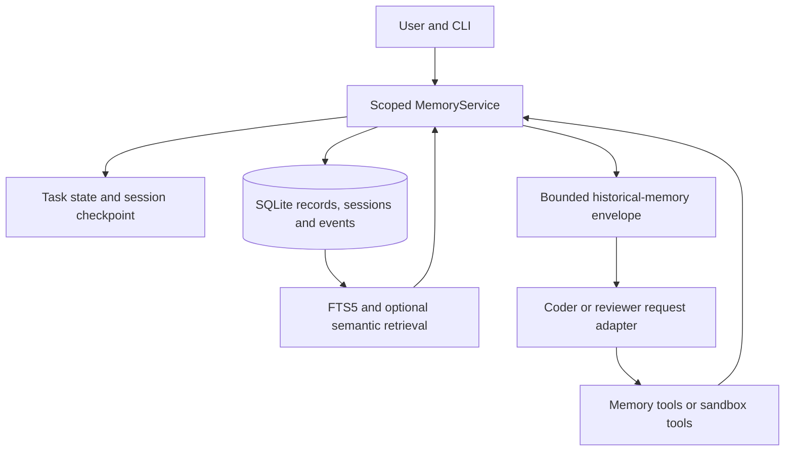

# Coding-agent memory implementation

Implementation status: 28 September 2026. This document supersedes the prototype status in [Week 3 research](week-3-memory-research.md), while preserving that document as historical contribution evidence.
The memory component is integrated into the coder CLI. This does not establish completion of the whole multi-agent assignment or guarantee a grade.

## Architecture and boundaries

Memory lives outside the model and survives application restarts. Each model request receives a selected, bounded view of that memory.
The design separates durable facts, session conversation, observable task state and developer-controlled procedures.

`memory/memory.py` owns storage, lifecycle operations, query filtering and ranking. `memory/service.py` owns session identity, selective writes, compaction and agent-facing tools.
`memory/prompt.py` is the common serializer used by both budgeting and request construction. `memory/embeddings.py` isolates the optional provider dependency.
`memory/context.py` compacts complete tool exchanges; `memory/privacy.py` shares credential detection between validation and redaction. `memory/observations.py` bounds sandbox tool outputs while retaining structured fields.
`main.py` owns the adaptive coder/tool loop. The reviewer uses the same message protocol; the CLI does not yet coordinate coder/reviewer work automatically.

## Why SQLite, not a hosted database

SQLite fits this local, small-team assignment: no server, account, network dependency or ongoing database bill is required. A temporary database also makes tests reproducible.
FTS5 supports indexed lexical retrieval suited to package names, paths and error codes. The application uses an external-content FTS table with insert/update/delete triggers. See [SQLite FTS5](https://www.sqlite.org/fts5.html).
The store enables WAL and a busy timeout, closes connections deterministically and uses immediate write transactions for operations such as duplicate checks and supersession.
WAL supports local reader/writer concurrency, but SQLite still serializes writers and is not a distributed database. See [SQLite WAL](https://www.sqlite.org/wal.html).
Migration preserves the earlier four-column prototype and indexes its pre-existing rows. Existing unscoped rows remain global; inspect them before sharing a database between unrelated projects.

A hosted PostgreSQL/Supabase service becomes useful when deployment needs authenticated users, remote workers, centralized backups or higher write concurrency.
That change would require an authorization design and deployment work. Moving rows to a cloud database alone would not improve memory quality, relevance or truthfulness.

## Mapping the lecture to running code

Page numbers below refer to PDF pages; slide numbers identify individual lecture slides.

| Lecture concept | Implementation and evidence |
| --- | --- |
| Working memory, p6–7/sl12–13 | `TaskState`: goal, plan, active step, assigned agent, latest observation, retries, artifacts, unresolved command failures, status and error |
| Short-term memory, p7/sl14 | Persisted session context, bounded recent turns and complete tool exchanges, extractive rolling summaries |
| Long-term memory, p8/sl15 | Scoped SQLite facts with provenance, timestamps, importance, reliability and lifecycle status |
| Procedural memory, p8/sl16 | Version-controlled prompts, memory policy, tool schemas and workflow code; a `procedure` record is still untrusted reference data |
| Episodic/reflection memory, p13/sl25 | Bounded actual tool observations and narrowly qualified recovery lessons |
| Retrieval and ranking, p12/sl23–24 | Metadata filtering, keyword search, optional semantic candidates, recency/importance/reliability ranking and budget selection |
| Quality/privacy, p13/sl26 | Duplicate controls, corrections, expiry, logical deletion, provenance and credential rejection/redaction |

These categories also align with the distinction between thread state and durable semantic/episodic/procedural knowledge in [LangChain's memory concepts](https://docs.langchain.com/oss/python/concepts/memory).
The project implements the concepts directly and does not require LangChain or LangGraph.

## Seven-stage memory lifecycle

Lecture p9/sl18 describes Observe → Store → Index → Retrieve → Use → Update → Forget.

| Stage | Implemented behavior |
| --- | --- |
| Observe | Receive user requests, observable plans and actual tool results |
| Store | Save selected facts/episodes; checkpoint sanitized session and task state |
| Index | Maintain FTS5 through transactional triggers; cache optional embeddings by content and provider identity |
| Retrieve | Filter every identity/status/expiry dimension before ranking; add eligible standing requirements |
| Use | Insert a source-bearing historical-memory message under a fixed application memory policy |
| Update | Atomically supersede facts; optimistic revisions protect session checkpoints |
| Forget | Exclude expired/inactive facts, delete selected facts/sessions, evict old summaries/events |

Expiry excludes records from recall; it does not immediately erase their database rows. `/memories` allows inspection of visible statuses.
The implementation does not run a scheduled retention job or infer arbitrary semantic contradictions automatically.

## What the agent can remember

Explicit `/remember` commands persist user-provided text. `/remember:requirement`, `/remember:constraint`, `/remember:preference` and `/remember:decision` make intent clear.
Ordinary coding turns are selectively inspected for explicit durable intent, for example `Remember that ...`, `For this project ...`, `I prefer ...`, `nhớ ...` or `tui thích ...`.
Automatic capture preserves the original text and only handles the implemented introductory patterns; it is not a general multilingual fact extractor. Generic task requests such as `tui muốn ...` are not automatically permanent facts.

The model's `memory_remember` tool must provide an 8–2,000-character exact quote from the latest user request and an allowed memory type.
It cannot choose another project/user namespace, save an invented paraphrase as a user fact, or promote instructions found in tool/document output through that tool.
Exact quoting establishes provenance, not objective truth: the user may express a mistaken or temporary claim. Sources and uncertainty still matter.
Generated answers and raw provider reasoning fields are not automatically promoted to trusted durable knowledge.

`memory_correct` applies the same exact-quote requirement to a replacement of an owned record, preserving its predecessor as superseded. The correction check examines the fact being quoted, rather than blocking a whole request because it contains a verb such as “replace.” When the quote contains recognized correction wording, a local FTS query looks for up to six active, scoped user/document predecessor candidates after removing boilerplate terms. If candidates exist, the write asks the model to inspect them and use `memory_correct` for a changed fact, or quote an independent fact separately. This check makes no remote embedding calls and does not itself decide that two facts contradict. Automatic capture uses the same predecessor check.

Repeating an identical active fact in the same scope/type refreshes the existing row when the new evidence has at least the previous source authority and reliability. It updates recency and provenance, retains the greater importance and renews eligible expiry without multiplying records. The application ranks user provenance above document and tool provenance for this purpose; weaker evidence cannot overwrite a stronger fact or extend its lifetime. Equal-authority refreshes do not shorten an existing lifetime. These source labels are controlled by the application; the model's memory tools cannot choose them.

`memory_search` lets the agent inspect scoped recall during a task. `memory_update_task` checkpoints a concise `current_plan` and `active_step` as working state.
Plan items are observable action descriptions with bounded list/string sizes. Saving a plan neither verifies its claims nor changes developer-controlled rules.

Actual `run_command` results and tool failures produce bounded `episode` or `error` records with tool name, command excerpt, exit code, output excerpt and source reference.
Successful file reads/writes stay in short-term context instead of copying complete source files into the durable fact store.
Tool episodes expire after 30 days because environments change. Their reliability represents observed execution evidence, not a guarantee of present validity.
Task state retains up to 20 unresolved command failures keyed by the full, trimmed command. These survive intervening file reads, writes and checkpoint restoration. Successful writes attach a bounded list of changed file paths to pending failures; when the same command subsequently returns exit code zero, a qualified `lesson` links the prior error record, changed files and latest output.
The lesson says that recovery was observed; it does not claim to know the root cause, prove that those file changes caused recovery, prove a code fix correct, or establish that every test passed. These lessons also expire after 30 days. A different command spelling is not automatically treated as the same command.

## Retrieval and standing requirements

Every record can be scoped by project, user, session, task and agent. Requested identities allow matching or global records; omitted identities exclude records private to that dimension.
Filtering precedes candidate ranking and optional provider calls. The service fixes the caller's scope; low-level `MemoryStore` methods remain an administrative API.
The default project ID combines the resolved directory name with a path hash, avoiding collisions between repositories with the same basename. The default user ID is the OS username.

FTS5 receives up to 48 quoted tokens after common question words are removed. Tokens are selected across the whole query, prioritizing error codes, identifiers and path components, rather than cutting off the first 30 words. The automatic query combines unresolved errors, recent failure evidence, the active step, original goal and latest request, so a read or edit does not erase the diagnostic being investigated.
FTS5 retrieves a bounded candidate set, then combines keyword rank with importance, reliability and recency.
Active status and unexpired timestamps are required. Duplicate result filtering preserves code punctuation rather than treating distinct expressions as the same fact.
The model receives each selected record's ID, type, content, source category and reliability. Full provenance, scores and retrieval explanations remain in the retrieval event shown by `/trace`; `/search` displays the compact model-facing envelope. Scores are ranking heuristics, not calibrated probabilities.

The service also considers standing facts: active, in-scope user/document requirements, constraints or preferences with reliability at least 0.9. The candidate limit is derived from the memory budget, `min(64, max(8, memory_tokens // 12))`, and candidates are ordered by importance and update time. This allows more than four short requirements to remain available for unrelated wording such as “Implement the endpoint.”
Packing happens in phases. When ranked query matches exist, the first standing-fact pass may use only half the envelope budget; ranked matches then use the full budget, followed by remaining standing facts in any unused space. This prevents numerous standing requirements from consuming all space before a relevant error or lesson is considered. Records remain whole, so a candidate can still be skipped if it cannot fit. The service does not guarantee that every standing requirement or query match will be injected.

## Optional semantic retrieval

`EmbeddingProvider` has an identity/fingerprint and an `embed(texts)` operation; a local model can implement it without changing the service.
The OpenRouter adapter is enabled only when `MEMORY_EMBEDDING_MODEL` is explicitly set. It implements the provider's [embedding request API](https://openrouter.ai/docs/api/api-reference/embeddings/submit-an-embedding-request).
Candidate text is scoped before provider access. All eligible cached document vectors for the active provider are streamed and compared; the default 256-record limit bounds newly embedded or repaired records per retrieval, not cached search coverage. Records without vectors acquire semantic coverage gradually over subsequent queries.
Query vectors use a process-local LRU keyed by provider identity and a hash of the query, bounded by both entries and vector coordinates. A separate bounded cache reuses normalized document vectors. Persistent document vectors are checked against current content hashes and provider identity; malformed, stale or dimension-incompatible vectors are eligible for repair.
The query vector is obtained before document ingestion. New vectors are generated in batches of up to 32 and committed after each successful batch, so a later provider failure does not discard completed work. Database transactions finish before remote calls; eligibility and content are checked again when saving results.
Hybrid ranking combines keyword and cosine signals; metadata alone cannot make an unrelated semantic record eligible. This is a small-corpus implementation, not an approximate-nearest-neighbor vector database.
Query/provider failures fall back to local keyword retrieval; an ingestion failure retains already usable cached semantic matches. Remote embedding requests transmit eligible memory text and queries and may incur API charges. Cached-vector scanning still grows with the eligible corpus, so large deployments need separate indexing/performance work.
The provider contract and failure paths have offline tests. No live embedding API experiment was run, so semantic recall improvement is not claimed. See the optional experiment in [memory evaluation](memory-evaluation.md).

## Context budgets and prompt boundaries

Default budgets are 6,000 estimated tokens for recent history, 600 for the rolling summary and 1,800 for injected historical memory. The summary is included within the memory envelope budget.
The shared estimator is `ceil(UTF-8 bytes / 3)` across low-level retrieval, the compatibility retrieval helper, history and final prompt packing. It avoids inconsistent accounting for Vietnamese text and other multibyte characters. It is useful for bounded allocation, but neither an exact model tokenizer nor a guarantee for a provider's total context window. Low-level record retrieval accounts for content; the service additionally budgets the final injected representation and its metadata.
System prompts, tool schemas and the rest of the request also occupy context; this implementation does not provide complete model-specific context accounting.

Compaction first removes whole older user turns, preserving assistant tool calls together with their matching results. Within one long active turn, older completed exchanges can also become summaries. The current user message, latest exchange and any incomplete tool exchange remain intact; a parallel batch is never cut in half to meet the budget.
Extractive summaries retain bounded user-request/final-answer excerpts and observable tool details such as paths, commands, exit codes, errors and output tails. Assistant claims are labeled unverified, and older summary entries are evicted when necessary. Source files can be read again through tools instead of retaining every old file body.
If the current request or latest/pending exchange alone exceeds the budget, `ContextBudgetExceeded` stops explicitly. Smaller file pages/edits or a larger history budget are needed in that case.

`read_file` provides recoverable pagination through optional `start_line`, `max_lines` and `start_column` parameters. Before selecting a page, it reads and filters the complete file inside the sandbox, with a 2 MiB maximum. This keeps multiline credential labels visible to the filter even when the requested page starts in the middle of the value. A trusted standalone filter is sent with the page script; the target project need not contain the agent package.
The file filter uses equal-length masks that preserve physical line/column positions, including JSON configuration handling. Results include `path` and `redacted` alongside `next_line`/`next_column`, so callers can continue long lines and tell when returned content was masked. Files above the cap return an explicit error and require targeted command inspection. The whole file is filtered again for each page; a local near-cap probe took roughly 1.5 seconds per page. This avoids unsafe partial-file filtering but is a known latency cost for large files, not evidence of scalable file indexing.
Terminal tools similarly sanitize full stdout/stderr before applying head/tail clipping. Final diagnostics, exit code and truncation/redaction flags survive; subsequent observation packing preserves structured JSON. Memory-tool responses bypass generic sandbox-output truncation because `memory_search` already uses the exact historical-memory envelope budget.

`memory/prompt.py` serializes the exact historical-memory envelope used by the coder/reviewer adapter, including metadata and escaped markup.
The service budgets this final serialized form, so nested JSON quoting or `<`, `>` and `&` expansion cannot evade the injected-memory limit.
Task fields and summaries are bounded and reduced before record selection. When recall candidates exist, the initial working-state/summary allocation targets half the envelope budget. If the first fact still needs more space, that base can shrink further; whole records are then fitted without deleting their content. Oversized records are skipped, so this is a bounded allocation policy rather than a guarantee that every relevant fact fits.

Retrieved memory is a separate user-level data message under an application-controlled system policy. It does not become a system message and is excluded from the persisted conversation to avoid recursive duplication.
The policy gives current instructions and current tool evidence priority over old observations. JSON escaping and role validation defend message structure; they do not prove an LLM will resist every prompt injection.
Tool continuations preserve call/result groups and do not append a user message with `None` content. Provider reasoning fields are stripped from stored/request history.

## Checkpoints, concurrency and restart

Each session stores sanitized history, summary and structured task state with a revision. Updating a checkpoint requires the revision originally read by the caller.
A concurrent worker changing that revision triggers `CheckpointConflict` instead of silently overwriting newer state. Reload with `/resume SESSION_ID` before continuing.
The task state supports validated plan/assignment/artifact updates; its shared blackboard contract is available for future agent coordination.
The CLI records task start/finish, model usage when returned, retrieval IDs/latency/budget estimates and tool observations. Events are bounded to the latest 500 per session; `/trace` shows recent events.

`--resume` or `/resume` restores a conversation and task checkpoint in the current project/user scope. A task left running is treated as interrupted.
An ordinary message continues an unfinished task (`running`, `interrupted`, `stopped`, `failed` or `incomplete`) while keeping its task ID, goal, plan, artifacts, retry count and pending failures. `/continue [message]` also resumes an answered task; `/task <goal>` explicitly starts a new task in the same conversation. After an answered task, a normal message starts a new task. `/new` creates a separate session. Continuation uses the latest user message for exact-quote writes while retaining the original goal for working state and recall.
Pending tool calls receive an explicit unknown-outcome result so the message protocol remains valid. They are **not replayed** automatically.
The checkpoint is not a filesystem/process snapshot. A new sandbox starts from current host files, and previous sandbox edits are not restored or automatically exported by the current runner. Restored sessions carry an application-owned environment notice explaining that prior edits, artifacts and test results may refer to a different sandbox. The coder/reviewer request adapter receives this notice separately from historical memory, as trusted runtime context, so a small memory budget cannot trim it away. It remains visible across continuation, and both CLI restoration paths display it. This is an instruction to verify current state, not artifact recovery or proof that the model performs that verification.
The task status `answered` means the model returned an answer; it is not a verified coding-task success label. A round limit and explicit failure/interruption statuses bound the execution loop.

## Privacy, maintenance and deletion

The store rejects recognized credentials across persisted record fields; session/tool text uses the same detector through `memory/privacy.py`. JSON containers are processed recursively, including JSON-encoded source. Recognized literal values are replaced while preserving their quotes; source annotations, function calls, environment references and JSON Schema descriptions are preserved in the tested cases. Schema defaults/examples still pass through credential filtering.
Python annotation and string-boundary parsing prevents source such as `password: str` or `input("Enter password: ")` from being rewritten as a credential. File paths select explicit source/configuration modes: supported source extensions preserve ordinary variable references, while configuration text does not treat password values as annotations. JSON configuration receives recursive credential-field handling, including numeric/boolean values and typed wrappers; schema descriptions remain data while defaults/examples are filtered. The complete-file layout-preserving path keeps pagination coordinates stable.
Filtering remains best-effort, not a complete parser/scanner for every language. In ambiguous untyped text, bare assignments such as `api_key=short` are treated as configuration secrets; unrecognized or dynamically constructed secrets may be missed.
The sandbox copy excludes environment files, common credential locations/key extensions, database files and the configured memory database, including custom paths.
These mechanisms reduce accidental exposure but cannot identify every possible secret or unnecessary personal detail. The database is not encrypted.
Local project/user labels are isolation filters, not authenticated authorization. A hosted multi-tenant deployment would require a separate security design.

`/correct ID TEXT` retains the prior fact as superseded and inserts its replacement atomically. Duplicate writes and conflicting concurrent replacements have deterministic transactional behavior.
`/forget ID` deletes the durable record and associated searchable/vector representation. It does not remove the original words from session history.
`/delete-session ID` removes the selected transcript, summary, task checkpoint and session events. It does not delete independent durable facts whose provenance mentions that session.
Use both operations when both stores contain information to remove. Deletion is logical; SQLite pages, WAL files and external backups are not guaranteed forensic erasure.

## Usage, validation and remaining work

Follow the [README setup and command guide](../README.md) for `.env.example`, configuration, memory-only examples and sandbox prerequisites.
Run `python -m unittest discover -s tests -v` for persistence, scope, lifecycle, concurrency, compaction, budget, protocol and integration contracts. Tests use temporary databases and mocks.
A separate real two-process CLI save/restart/search smoke test verifies local persistence without a model or sandbox. Live model-assisted coding tasks and real remote embeddings were not validated by those tests. A live request attempted during the 28 September audit through the configured `openrouter/free` route returned HTTP 429; the local `minikube` executable was unavailable for a real coding-runner check. Neither attempt establishes live memory quality or coding-task success.
Run `python -m scripts.evaluate_memory --output Documentation/memory-evaluation-results.json` for the 40-query offline retrieval benchmark and read [its results/limitations](memory-evaluation.md).
That fixture is synthetic development data, not unseen coding tasks. The assignment still requires a separate evaluation of at least 30 end-to-end tasks and comparison against a simpler agent/workflow baseline.
See the [assignment/lecture audit](memory-requirements-audit.md) for the verified page/slide mapping and remaining evidence requirements.

The reviewer adapter accepts the same scoped context and tool continuations as the coder. Planner/executor modules remain stubs, and the CLI does not implement complete multi-agent delegation, disagreement handling or final-result integration.
Future work should measure actual task success, repeated failures, cross-session adherence and cost before choosing heavier infrastructure. Large-corpus retrieval, hosted authentication, full token accounting and durable artifact recovery need their own implementation and evidence.
